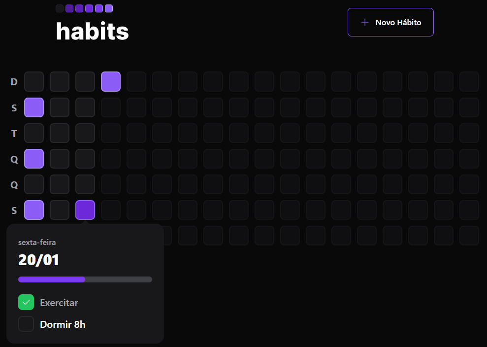
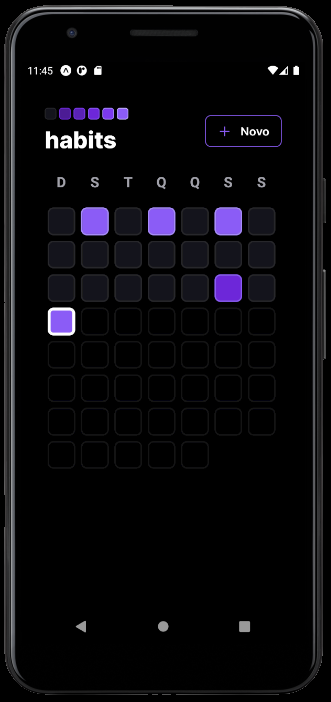

<h3 align="center">Habit Tracker</h3>
<p>
<p> 

## Sobre:
Aplicação desenvolvida durante a primeira Next Level Week de 2023 [RocketSeat](https://rocketseat.com.br/).  
Neste projeto criamos uma aplicação completa (backend e frontend Web e Mobile) para criarmos e acompanharmos novos hávitos, após criarmos o novo hábito informamos a recorrência do mesmo (os dias das semanas que iremos executa-lo) e assim podemos acompanhar se em cada dia completamos todos os hábitos que nos propomos a fazer.  

---  
## Web:
<div align="center">
  
</div>


## Mobile:
<div align="center">
  
</div>

---

## :checkered_flag: Como utilizar:
Para iniciar os projetos server e web podemos utilizar o comando: 
```bash
 npm run dev 
 ```
Agora para o projeto mobile devemos utilizar:
```bash
 npx expo start 
 ```
 ---

## :robot: Tecnologias:
- Fastify
- React
- React Native
- Expo